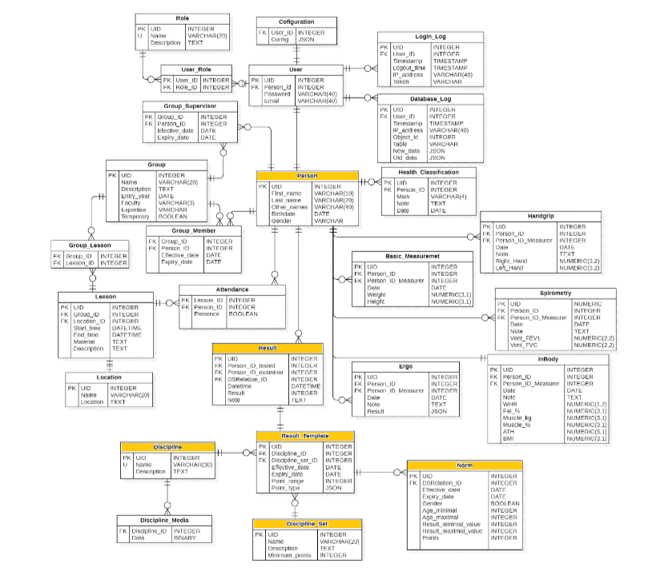

# GQL_TV

__Ondřej Begy__ 
________________________________________________________________________

## Popis

Projekt vytvoření backendu databází pro systém, který zahrnuje požadavky stanovené CTVS. Tento systém je následně součástí UOIS. Základem jsou nejdůležitější funkce systému pro potřeby CTVS. V budoucnosti je zde možnost systém rozšířit o další moduly a postupně jej vylepšovat a přidávat další funkce.

Mezi požadavky tohoto systému patří:

- výpis údajů o studentovi (pohlaví, rok narození, výsledky přezkoušení atd.)
- přehled studentů, kteří jsou přiřazení k učební skupině
- zapisování výsledků z přezkoušení a udělování zápočtu
- editace výsledků pouze pro uživatele s oprávněním (tělocvikář přidělený ke skupině)
- editace disciplíny pro jednotlivé učební skupiny či studenty
- záznam o prodloužení zápočtu u studenta
- student má možnost podívat se na své výsledky (pravděpodobně řešeno skrze gql_users?)
- záznam a historie editace disciplín a výsledků (řešeno skrze UOIS)

## Struktura systému
Žlutě znázorněné databáze jsou základ systému pro CTVS.

Zdroj: RÁČIL, Tomáš. IS pro sběr a vyhodnocení vybraných anatomicko- fyziologických dat a výzkumů. DIPLOMOVÁ PRÁCE. BRNO: UNIVERZITA OBRANY V BRNĚ, 2020.

Zde bude umístěná aktualizovaná struktura systému:

## Úkoly

- udělat návrh databází = hotovo
- vytvořit tabulky databází = hotovo
- vytvořit GQL modely databází = hotovo
- odstranit chyby v propojení GQL modelů = hotovo
- předělat systemadata.json (jeden uživatel s jedním výsledkem) = hotovo
- vytvořit a zprovoznit READ operace pro jedotlivé GQL modely = hotovo
- vytvořit a zprovoznit CUD operace pro jednotlivé GQL modely

________________________________________________________________________

## Záznamy

- 25.11. = vytvoření systemdata.json a odstranění chyb v rámci propojení GQL modelů
- 5.12. = zprovnění READ operací pro každý GQL model
- 18.12. = zprovoznění CUD operací pro každý GQL model
________________________________________________________________________

## Poznámky

Důležité termíny

- 7.10.2024 vybraná témata, publikované repositories
- 7.11.2024 1. projektový den, doložení kompletních descriptions (gql modely)
- 9.12.2024 2. projektový den, doložení funkcionality (crud)
- 29.1.2025 3. projektový den, doložení testů

## Poznámky pro spuštění

- uvicorn main:app --env-file enviroment.txt --reload